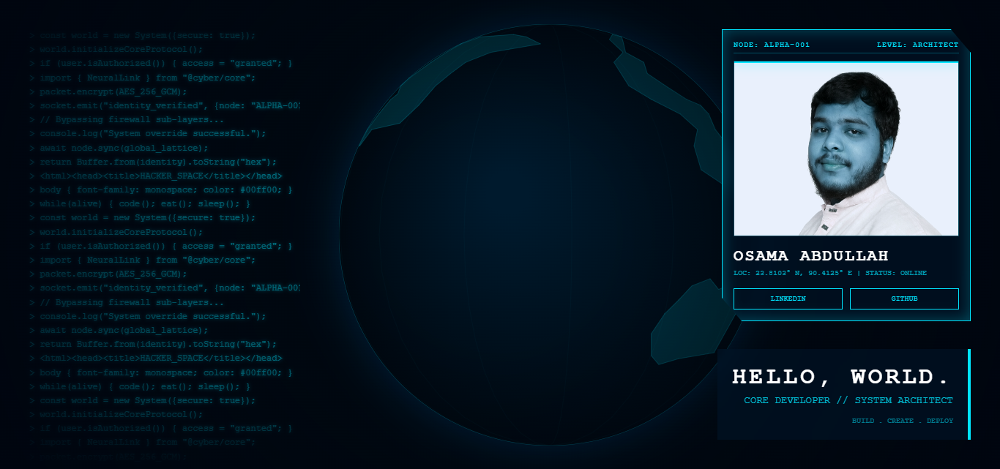

# Alpha-001: Identity Node

A sleek, cyberpunk-themed single-page web portfolio with an advanced hacker vibe layout. This is a futuristic personal demonstration site designed to showcase your identity, skills, and presence as a developer.

## 🎨 Visual Preview



## ✨ Features

- **Animated Canvas Background** - Dynamic visual effects with particle systems and geometric patterns
- **Neon Aesthetic** - Cyan/electric blue color scheme (#00e5ff) inspired by cyberpunk design
- **HUD Identity Card** - Display card with your photo, name, level, and location
- **Monospace Typography** - Authentic hacker terminal feel with Courier New font
- **Interactive Elements** - Social media links for LinkedIn and GitHub
- **Vignette Effect** - Professional darkened edges for cinematic depth
- **Responsive Design** - Optimized for desktop viewing
- **Animated Earth** - 3D earth visualization in the background

## 🚀 Quick Start

1. Open `index.html` in your web browser
2. Customize the following in `index.html`:
   - Replace `OSAMA ABDULLAH` with your name
   - Update the location coordinates (LOC field)
   - Add your LinkedIn and GitHub URLs
   - Replace `YOUR_LINKEDIN_URL` and `YOUR_GITHUB_URL`
3. Replace the placeholder images:
   - `static/photo.png` - Your portrait photo (recommended: 300x300px)

## 📁 Project Structure

```
alpha-001/
├── index.html          # Main HTML file
├── static/
│   ├── style.css       # Styling with neon theme
│   ├── script.js       # Canvas animations and interactions
│   ├── photo.png       # Your portrait (customize this)
│   └── page-visual.png # Project preview image
└── README.md           # This file
```

## 🎯 Customization Guide

### Update Your Identity
Edit the following in `index.html`:
- **Name**: Line with `OSAMA ABDULLAH`
- **Level/Title**: Change `LEVEL: ARCHITECT`
- **Location**: Update coordinates and status
- **Social Links**: Add your actual LinkedIn and GitHub URLs

### Styling
All styling is controlled in `static/style.css`. Key color variables:
- `--neon-blue: #00e5ff` - Primary accent color
- `--deep-bg: #000a14` - Background color
- Modify these to customize the color scheme

## 🔧 Technical Details

- **Canvas API** - Used for animated backgrounds and earth visualization
- **Pure HTML/CSS/JavaScript** - No external dependencies
- **Fixed Layout** - Designed for desktop browsers
- **Monospace Font** - Courier New for authentic terminal feel

## 💻 Browser Support

Best viewed in modern browsers (Chrome, Firefox, Safari, Edge)

## 📝 Notes

- The page-visual.png shows the expected design output
- Keep the monospace font for authenticity
- The cyan neon color (#00e5ff) is the signature aesthetic
- Location coordinates can be customized to your actual/preferred location

---

**Status**: ONLINE | **Version**: ALPHA-001 | **Last Updated**: 2026
